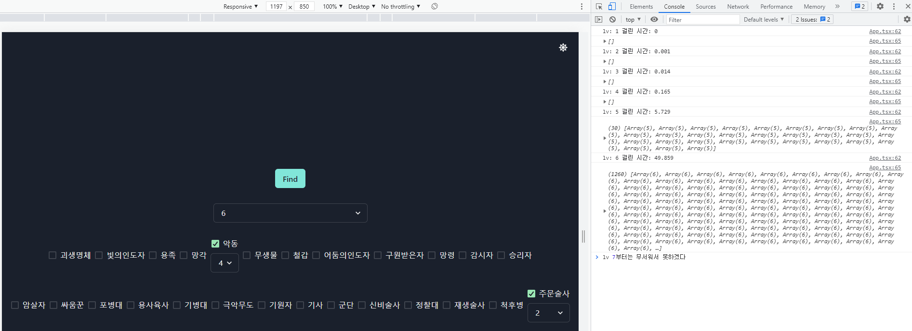

# 롤토체스 조합 찾아주는 툴

## 만들게 된 배경

* 나는 레벨 8, 9가 되어도 발동하는 시너지가 세네개 뿐인데, 전쓰트같은 유튜버는 6~7개는 기본으로 발동시키는게 부러웠음 
* 이런 조합을 찾아주는 사이트가 없었다(롤체지지에도 안나왔다. 근데 만들고 보니 왜 없는지 알게되었지..)
* 그래서 원하는 시너지를 선택하면 가능한 챔피언들의 조합이 있는지를 찾아주는 툴을 제작하게 됨.

## 현재까지 모습

## 문제점

* 레벨 증가에 따라 진짜 조합(Combination)의 숫자도 기하급수적으로 늘어나면서 검색시간이 어마무시함...
* 알고리즘 문제인데 어떻게 해결해야할 지 고민중

## 알고리즘 문제 제작

* 아이디어를 들키지 않고 문제 해결 방법을 의논하기 위해 실제 알고리즘 문제도 만들어 보았다.
* [여기를 클릭](./algo.md)
* 그치만 아직 못찾음...

## ToDo

* 알고리즘 최적화
* 시너지에 우선순위를 매기고 우선순위가 높은 강력한 조합을 몇 개만 출력
* 내가 현재 사용하는 챔피언들을 변수에 포함하여 검색(이 경우 조합의 수가 줄어들어 속도가 빨라질 수는 있음.. 그치만 근본적인 해결은 아닐듯)
* 롤 api 사용

## 최종목표

* 서비스를 배포하고 광고를 넣어 앉아서 떼돈을 버는 캐시카우를 만들자.